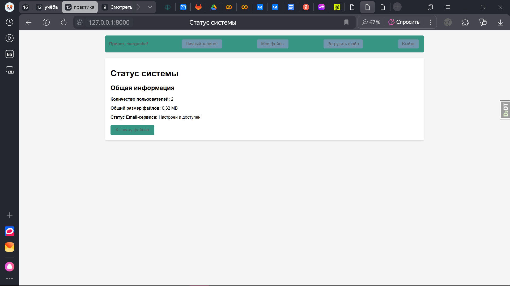

# Django File Manager

## Описание Проекта

Минимальный веб-проект на Django, позволяющий пользователям загружать, просматривать и заменять файлы. Также реализована функция отправки отчета по электронной почте через SMTP-сервер Mail.ru. Проект включает в себя REST API для взаимодействия с файлами и задел для интеграции функций машинного обучения.

## Функциональность

Проект реализует следующие возможности:

*   **Настройка окружения и зависимостей:** Установка и конфигурация Django, Django REST Framework, Django Allauth и других необходимых библиотек.
*   **Реализация аутентификации пользователей:**
    *   Интеграция `django-allauth` для управления регистрацией, входом и выходом пользователей.
    *   Модификация модели `StoredFile` для установления связи файлов с конкретными пользователями через `ForeignKey` к модели `User`.
    *   Обновление представлений и шаблонов для обеспечения отображения и управления файлами только текущего аутентифицированного пользователя.
*   **Расширение функционала файлового менеджера:**
    *   **Загрузка файлов:** Пользователи могут загружать файлы с обязательным описанием.
    *   **Список файлов:** Отображение списка всех загруженных файлов текущего пользователя с ссылками для скачивания, описанием и датой загрузки.
    *   **Замена файлов:** Возможность заменить существующий файл на новый; старый файл автоматически удаляется с диска после успешной замены.
    *   **Удаление файлов:** Возможность удалить файл из списка и с диска.
    *   **Страница профиля (`/profile/`):** Отображение статистики пользователя, включая общее количество загруженных файлов, дату последней активности и список последних пяти загруженных файлов.
    *   **Страница статуса системы (`/status/`):** Предоставляет общую информацию о системе: количество зарегистрированных пользователей, общий размер всех загруженных файлов и статус настроек Email-сервиса.
    *   **Email-уведомления:** Автоматическая отправка писем на заданный адрес при создании, замене и удалении файлов. В теме письма указывается только имя файла без полного пути.
    *   **Отправка отчета:** Форма для отправки пользовательских электронных писем с возможностью прикрепления выбранного файла, через настроенный SMTP-сервер Mail.ru.
*   **Разработка REST API:**
    *   **`FileViewSet`:** Реализация API-эндпоинтов для выполнения операций Create, Retrieve, Update, Delete (CRUD) с файлами.
    *   Настройка прав доступа (`IsAuthenticated`) для всех API-эндпоинтов, гарантирующая, что пользователи могут взаимодействовать только со своими файлами.
*   **Тестирование и повышение покрытия кода:**
    *   Разработка комплексного набора юнит-тестов с использованием `pytest` для проверки всей реализованной функциональности (загрузка файлов, работа API, отправка уведомлений, корректность отображения страниц профиля и статуса).
    *   Исправление проблем в существующих тестах и добавление новых, что позволило довести общее тестовое покрытие до 89% (с требуемых 80%).
*   **Подготовка к интеграции ML-функционала:**
    *   Создано новое Django-приложение `ml_api` для изоляции логики машинного обучения.
    *   Реализована модель `MLRequest` для структурированного хранения всех входящих запросов к будущей ML-модели, их входных данных, результатов и времени создания.
    *   Добавлен API-эндпоинт `POST /api/ml/predict/` в качестве заглушки, который принимает входные данные, сохраняет их в `MLRequest` и возвращает статус "ok" с идентификатором запроса.

## Проблемы и их решение

В процессе разработки были выявлены и успешно решены следующие проблемы:

*   **Проблема 1: Некорректный формат темы email-уведомлений.**
    *   **Описание:** Изначально в темах email-уведомлений о файловых операциях (создание, замена, удаление) указывался полный путь к файлу, что было избыточно и неинформативно для пользователя.
    *   **Решение:** Модифицирована функция `send_file_notification` в `core/views.py` для использования `os.path.basename()` при формировании темы письма, чтобы отображать только имя файла. Соответствующие тесты были скорректированы для проверки нового формата темы.
*   **Проблема 2: Отсутствие аутентификации в некоторых API-тестах.**
    *   **Описание:** Некоторые тесты, взаимодействующие с API (например, `test_api_file_upload_authenticated`, `test_api_file_update_authenticated`, `test_api_file_delete_authenticated`), падали из-за того, что API-клиент не был должным образом аутентифицирован перед выполнением запросов.
    *   **Решение:** В начало всех затронутых API-тестов добавлена строка `api_client.force_authenticate(user=admin_user)` для принудительной аутентификации тестового пользователя.
*   **Проблема 3: Отсутствие email-уведомлений при операциях обновления и удаления файлов через API.**
    *   **Описание:** Несмотря на то, что веб-интерфейс отправлял уведомления, API-эндпоинты для обновления и удаления файлов не инициировали отправку email-уведомлений, что приводило к провалу соответствующих тестов.
    *   **Решение:** В классе `FileViewSet` в `core/views.py` были добавлены вызовы функций отправки email-уведомлений в методы `perform_update` и `perform_destroy` для обеспечения отправки уведомлений после успешного обновления или удаления файла.
*   **Проблема 4: Невалидная форма на странице замены файла приводила к редиректу вместо отображения ошибок.**
    *   **Описание:** Если пользователь пытался заменить файл, но отправлял невалидные данные формы, система делала HTTP-редирект (статус 302) на страницу списка файлов вместо того, чтобы повторно отобразить форму с сообщениями об ошибках (ожидался статус 200).
    *   **Решение:** В представлении `replace_file` в `core/views.py` изменен код таким образом, что при `form.is_valid()` возвращается `redirect('file_list')`, а в случае `else` (невалидной формы) — `render` с исходной формой, ошибками и статусом 200.
*   **Проблема 5: Ошибка доступа к базе данных в тесте `test_status_page_anonymous`.**
    *   **Описание:** Тест для страницы статуса, доступный анонимным пользователям, пытался обратиться к базе данных без необходимого разрешения, что приводило к ошибке "RuntimeError: Database access not allowed".
    *   **Решение:** К тесту `test_status_page_anonymous` в `core/tests.py` был добавлен декоратор `@pytest.mark.django_db`, который предоставляет тесту доступ к тестовой базе данных Django.
*   **Проблема 6: Недостаточное тестовое покрытие.**
    *   **Описание:** Изначальное тестовое покрытие проекта было ниже требуемого порога в 80%, что указывало на наличие непроверенных участков кода, особенно в `core/views.py`.
    *   **Решение:** Добавлены новые тесты для проверки функциональности страниц профиля и статуса (как для аутентифицированных, так и для анонимных пользователей), а также для различных сценариев обработки ошибок, таких как невалидные формы загрузки/замены файлов, сбои при отправке email. Это позволило значительно увеличить покрытие.

## Скриншоты работы системы

*   **Страница регистрации/входа:**

*   **Страница загрузки файла (`/upload/`):**

*   **Список файлов (`/`):**

*   **Страница профиля (`/profile/`):**

*   **Страница статуса (`/status/`):**

*   **API-эндпоинт `/api/ml/predict/`:**

*   **Пример email-уведомления (опционально):**

## Тестовые данные

Для демонстрации функциональности системы были созданы следующие пользователи и файлы:

1.  **Пользователи:**
    *   **Имя пользователя:** `user1`
    *   **Пароль:** `asxbkmn38z_u1`
    *   **Имя пользователя:** `margusha`
    *   **Пароль:** `asxbkmn38z_su`

2.  **Файлы:**
    *   Каждый из вышеуказанных пользователей загрузил по **3 тестовых файла**. Эти файлы можно просмотреть в списках файлов каждого пользователя и убедиться в корректности их хранения и отображения.

## Требования

*   Python 3.x
*   Django 5.2.1 (или совместимая версия)
*   Учетная запись Mail.ru для отправки отчетов (потребуется пароль приложения).

## Установка и Запуск

1.  **Клонируйте репозиторий:**

    ```bash
    git clone https://github.com/titorenko-rita/file_manager_for_pp.git
    cd file_manager_for_pp
    ```

2.  **Создайте виртуальное окружение (рекомендуется):**

    ```bash
    python -m venv venv
    ```

    *   Для Windows:
        ```bash
        venv\Scripts\activate
        ```
    *   Для macOS/Linux:
        ```bash
        source venv/bin/activate
        ```

3.  **Установите зависимости:**

    ```bash
    pip install -r requirements.txt
    ```
    *(Примечание: Если файла `requirements.txt` нет, вы можете его создать, выполнив `pip freeze > requirements.txt`, а затем использовать его.)*

4.  **Настройте базу данных и миграции:**

    ```bash
    python manage.py makemigrations ml_api # Создаст миграции для нового приложения ml_api
    python manage.py migrate # Применит все миграции
    ```

5.  **Создайте суперпользователя (для доступа к админ-панели и тестам):**

    ```bash
    python manage.py createsuperuser
    ```
    (Следуйте инструкциям на экране, создайте `testadmin` с паролем `password123` или другим, который вы используете в тестах)

6.  **Настройте учетные данные Mail.ru:**

    Отредактируйте файл `filemanager/settings.py` и укажите ваши данные для отправки почты:

    ```python
    # Mail.ru SMTP settings
    EMAIL_BACKEND = 'django.core.mail.backends.smtp.EmailBackend'
    EMAIL_HOST = 'smtp.mail.ru'
    EMAIL_PORT = 465
    EMAIL_USE_SSL = True
    EMAIL_HOST_USER = 'ваш_email@mail.ru'  # Замените на ваш email
    EMAIL_HOST_PASSWORD = 'ваш_пароль_приложения'  # Замените на пароль приложения Mail.ru
    ```
    **Важно:** Используйте именно **пароль приложения**, сгенерированный в настройках безопасности вашего аккаунта Mail.ru.

7.  **Запустите сервер разработки:**

    ```bash
    python manage.py runserver
    ```

8.  **Откройте проект в браузере:**

    Перейдите по адресу [http://127.0.0.1:8000/](http://127.0.0.1:8000/).

## Структура Проекта

## Тестирование

*   Проверьте загрузку различных типов файлов (txt, pdf, img).
*   Проверьте функцию замены файла, убедитесь, что старый файл удаляется.
*   Проверьте функцию удаления файла.
*   Проверьте отправку отчета по электронной почте на реальный адрес.
*   Проверьте работу API-эндпоинтов (список, загрузка, детали, обновление, удаление) через Postman или аналогичный инструмент, убедитесь в корректной аутентификации.
*   Отправьте POST-запрос на `/api/ml/predict/` с произвольными JSON-данными (предварительно авторизовавшись) и убедитесь, что возвращается `{"status": "ok", "request_id": ...}`.
*   Запустите все юнит-тесты командой `pytest core/tests.py -v` и убедитесь, что все 20 тестов проходят и покрытие составляет 89%.

```bash
pytest core/tests.py -v --cov=. --cov-report=term-missing
```
```
*(Пример вывода после успешного выполнения тестов)*
======================================== test session starts =========================================
...
collected 20 items

core/tests.py::test_file_upload_authenticated PASSED                                            [  5%]
...
core/tests.py::test_status_page_anonymous PASSED                                                [100%]

========================================== warnings summary ==========================================
... (могут быть предупреждения о Deprecated конвертерах DRF, это нормально для текущей версии Django)
============================ 20 passed, 1 warning in X.XXs ==============================

---------- coverage: platform ..., python 3.11.5-final-0 -----------
Name                              Stmts   Miss  Cover   Missing
--------------------------------------------------------------
core\__init__.py                      0      0   100%
core\admin.py                         1      0   100%
core\apps.py                          4      0   100%
core\forms.py                        12      0   100%
core\migrations\0001_initial.py       7      7     0%   3-16
core\migrations\__init__.py           0      0   100%
core\models.py                        9      0   100%
core\serializers.py                   7      0   100%
core\tests.py                       197      2    99%   257, 283
core\urls.py                          8      0   100%
core\views.py                       183     39    79%   62, 67-69, 92-93, 105, 108-109, 114-117, 150, 158-192, 269-270, 289-290
ml_api\__init__.py                    0      0   100%
ml_api\admin.py                       1      1     0%   3
ml_api\apps.py                        4      0   100%
ml_api\migrations\0001_initial.py     7      7     0%   3-16
ml_api\migrations\__init__.py         0      0   100%
ml_api\models.py                      5      0   100%
ml_api\tests.py                       0      0   100%
ml_api\urls.py                        5      0   100%
ml_api\views.py                      11      0   100%
--------------------------------------------------------------
TOTAL                               428     48    89%

Required test coverage of 80% reached. Total coverage: 88.79%